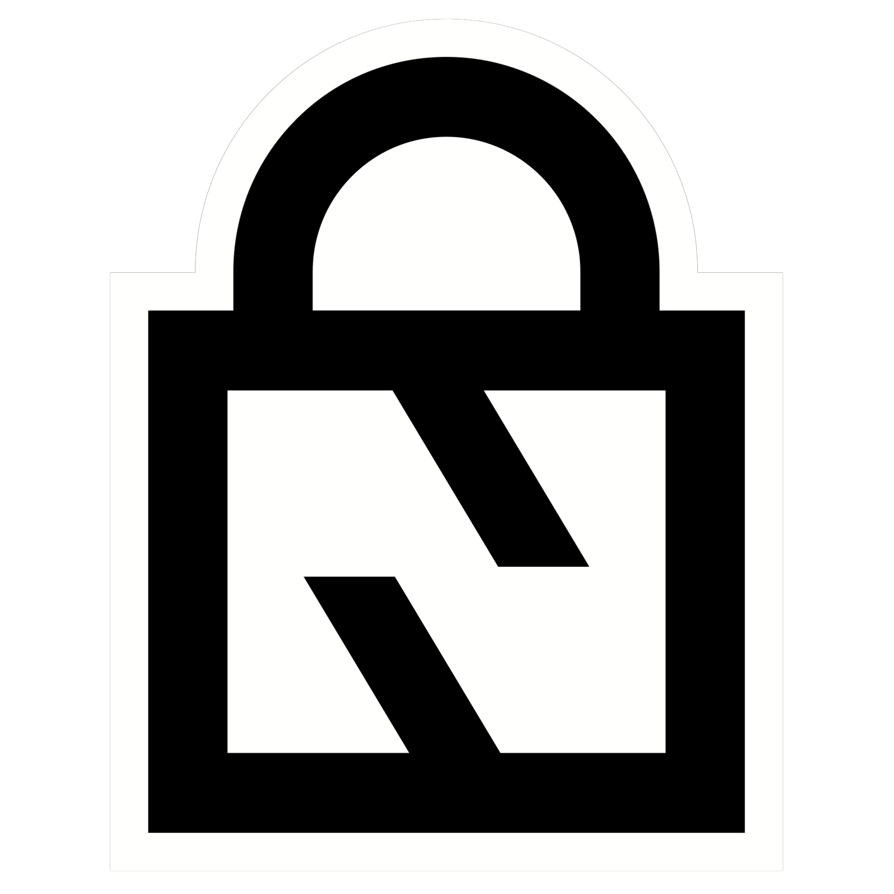
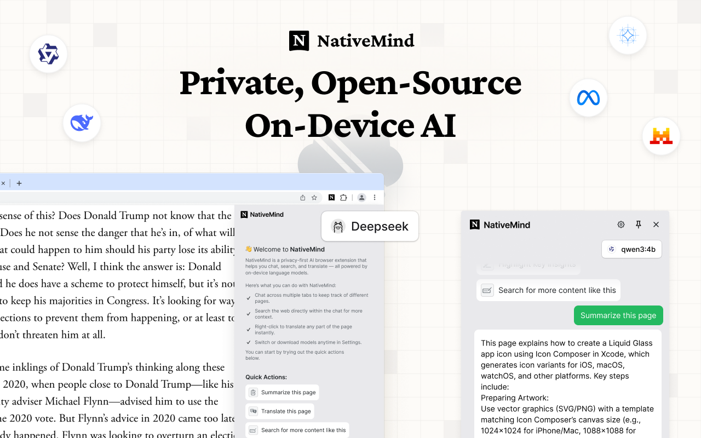

<div align="center">

  
[English](./README.md) 

# NativeMind - 私有化、设备端AI助手，无需云端依赖

**私有AI的未来已至，完全在您的设备上运行**

*体验零云端依赖的强大AI能力*



[]()
[]()
[]()

[](https://github.com/ollama/ollama)
[](https://github.com/mlc-ai/web-llm)

[](https://chromewebstore.google.com/detail/nativemind-private-on-dev/mgchaojnijgpemdfhpnbeejnppigfllj)
[]()

[](https://discord.gg/b8p54DKhha)
[](https://www.gnu.org/licenses/agpl-3.0)

---

*终于，**真正属于您的AI**。NativeMind提供尖端智能而无需云端依赖——**响应更快、零追踪、无限使用**——所有功能都在您的浏览器中安静运行，由您完全掌控。*

</div>

## 📦 快速开始

### 🚀 安装

直接从[Chrome应用商店](https://chromewebstore.google.com/detail/nativemind-private-on-dev/mgchaojnijgpemdfhpnbeejnppigfllj)安装。

### ⚡ 首次设置

1. **固定扩展**：点击扩展图标并固定到工具栏
2. **设置Ollama**：按照[Ollama设置指南](https://nativemind.app/blog/tutorial/ollama-setup)获取完整AI能力
3. **开始使用**：点击浏览器工具栏中的NativeMind图标

<div align="center">

<br>
</div>

## ✨ 核心功能

### 🤖 **私有AI助手**
- **智能对话**：多标签页上下文感知的全面AI讨论
- **智能内容分析**：即时网页摘要和文档理解
- **通用翻译**：整页翻译与双语对照视图，支持选中文本翻译
- **AI增强搜索**：通过浏览器直接增强网页搜索能力
- **写作增强**：自动检测并提供智能重写、校对和创意建议
- **实时协助**：浮动工具栏根据上下文在所有网站出现

### ⚡ **AI模型集成**
- **离线优先设计**：下载模型后无需网络连接即可完全运行
- **模型灵活性**：根据性能和隐私需求切换不同模型

### 🌐 **通用兼容性**
- **跨浏览器支持**：原生支持Chrome和Edge
- **跨平台**：兼容Windows、macOS和Linux

## 🤖 AI模型选项

### 🦙 **[Ollama](https://github.com/ollama/ollama) (推荐)**
- **高级模型**：Deepseek、Qwen、Llama、Gemma、Mistral、Phi等
- **卓越性能**：充分利用系统资源
- **模型灵活性**：下载并切换专业模型
- **本地服务器**：自托管实现最大控制权

### ⚡ **[WebLLM](https://github.com/mlc-ai/web-llm) (快速试用)**
- **即时演示**：直接在浏览器中使用Qwen3-0.6B体验AI能力
- **零配置**：无需额外软件安装即可快速测试
- **WebAssembly驱动**：使用WebAssembly直接在浏览器中运行
- **试用体验**：在设置Ollama前评估扩展的完美选择

> 💡 **构建您的个人AI助手**：将NativeMind与[Ollama](https://github.com/ollama/ollama)结合，创建一个真正私密、强大的AI助手，理解您的工作流程并保护您的数据。使用[WebLLM](https://github.com/mlc-ai/web-llm)立即试用快速评估。

## 🔮 为何设备端AI是未来

### 云端AI的问题
在这个每个击键都可能被监控、每份文档都可能被分析的时代，**基于云端的AI服务代表着根本性的隐私风险**。您的敏感数据——个人文档、商业通信、创意作品——都成为他人训练数据或监控设备的一部分。

### 🚀 **性能革命**
**隐私不再意味着妥协。** 模型效率的近期突破意味着设备端AI现在**超越了云端替代方案**：

- **Qwen3-4B**：性能超越Qwen2.5-72B，同时体积缩小18倍
- **Gemma3-4B**：匹配Gemma2-27B性能，参数减少6.75倍，具有卓越图像识别能力
- **Phi-4**：在数学推理和竞赛问题上超越Gemini Pro 1.5
- **零延迟**：无网络延迟，即时响应
- **始终可用**：无API限制、速率限制或服务中断

### 🔒 **真正的数据主权**
**NativeMind让您重获控制权。** 通过完全在设备上运行AI模型，我们消除了云端AI的根本隐私风险：

- **100%设备端处理**：每个击键、每份文档、每次对话都留在您的设备上
- **零云端依赖**：数据永远不会传输到外部服务器
- **无企业监控**：没有科技巨头能分析您的使用模式或内容
- **无政府访问**：无后门或潜在的政府数据请求
- **无数据泄露**：如果数据从不离开设备，就无法从服务器被盗
- **无需账户**：无需注册或登录即可使用所有功能
- **开源透明**：每行代码都可公开审计

## 🛠️ 开发者指南

### 技术栈

<table>
<tr>
<td><strong>前端</strong></td>
<td>Vue 3 + TypeScript</td>
</tr>
<tr>
<td><strong>构建工具</strong></td>
<td>WXT (Web扩展工具) + Vite</td>
</tr>
<tr>
<td><strong>样式</strong></td>
<td>TailwindCSS</td>
</tr>
<tr>
<td><strong>AI集成</strong></td>
<td>WebLLM + Ollama + AI SDK</td>
</tr>
<tr>
<td><strong>包管理器</strong></td>
<td>PNPM</td>
</tr>
</table>

### 先决条件

- [Node.js](https://nodejs.org/) (推荐v22.14.0)
- [PNPM](https://pnpm.io/) (v10.10.0或更高)
- 现代浏览器(Chrome、Firefox或Edge)

### 安装

1. **克隆仓库**
```bash
git clone https://github.com/NativeMindBrowser/NativeMindExtension.git
cd NativeMindExtension
```

2. **安装依赖**
```bash
pnpm install
```

3. **启动开发服务器**
```bash
pnpm dev         # Chrome开发(默认)
pnpm dev:edge    # Edge开发
```

### 生产构建

```bash
# 开发构建
pnpm zip:beta

# 生产构建  
pnpm zip:prod

```

构建的扩展将位于`.output/`目录。

### 手动安装(开发)
1. **下载**：从[GitHub发布](https://github.com/NativeMindBrowser/NativeMindExtension/releases)获取最新版本
2. **安装**：打开`chrome://extensions/` → 启用"开发者模式" → 点击"加载已解压的扩展程序"
3. **设置**：固定扩展并选择AI模型

## 🛠️ 故障排除

### 常见问题

**扩展无法加载**
- 确保浏览器扩展页面已启用开发者模式
- 检查所有文件是否正确提取/加载
- 尝试刷新扩展页面并重新加载

**AI模型无法工作**
- **WebLLM**：确保足够RAM(推荐8GB+)和现代浏览器
- **Ollama**：确认Ollama本地运行在11434端口
- 清除浏览器缓存并重启扩展
- 检查浏览器控制台错误信息

**性能缓慢** 
- **WebLLM**：关闭其他标签页释放内存
- **Ollama**：确保足够系统资源
- 尝试更小的AI模型以获得更快响应
- 检查杀毒软件是否干扰

**翻译/摘要无法工作**
- 确认AI模型已正确加载
- 检查页面是否有受限内容策略
- 尝试刷新页面重试
- 确保页面内容是可选文本(非图片)

### 获取帮助
- 检查浏览器控制台(F12 → 控制台)获取错误信息
- 加入我们的Discord社区获取支持：https://discord.gg/b8p54DKhha
- 在[GitHub Issues](https://github.com/NativeMindBrowser/NativeMindExtension/issues)报告问题
- 报告中包含浏览器版本、操作系统和错误详情

## 🤝 贡献

<div align="center">
  
**欢迎贡献！帮助我们构建私有AI的未来。**

[]()
[]()

</div>

### 🚀 贡献者快速入门

1. **Fork**项目
2. **创建**特性分支(`git checkout -b feature/amazing-feature`)
3. **提交**修改(`git commit -m 'Add some amazing feature'`)
4. **推送**分支(`git push origin feature/amazing-feature`)
5. **发起**拉取请求

### 📋 开发指南

- ✅ 遵循现有代码风格
- ✅ 为新功能添加测试  
- ✅ 根据需要更新文档
- ✅ 确保隐私优先原则

## 📄 许可证

<div align="center">

**GNU Affero通用公共许可证v3.0**

*确保该项目保持开源和隐私优先*

详见[LICENSE](LICENSE)文件完整内容。

</div>

## 🙏 致谢

<div align="center">

*站在巨人的肩膀上*

</div>

- 👥 **Contributors**：感谢所有帮助塑造NativeMind的人
- 🛠️ **[WXT](https://github.com/wxt-dev/wxt)**：简化浏览器扩展开发
- 🧠 **[WebLLM](https://github.com/mlc-ai/web-llm)**：实现浏览器内AI能力
- 🦙 **[Ollama](https://github.com/ollama/ollama)**：支持本地LLM

---

<div align="center">

**为隐私和AI创新而❤️打造**

*如果觉得有用，[⭐给项目点赞](https://github.com/NativeMindBrowser/NativeMindExtension)！*

</div>
